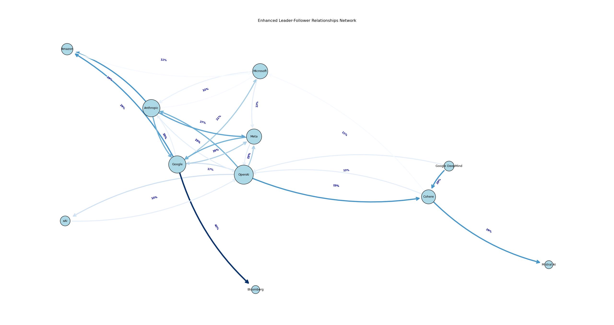

# LLM Competitive Dynamics Analysis



## Project Overview

This project analyzes the competitive dynamics between AI companies in the Large Language Model (LLM) space from 2020 to 2025. Using a comprehensive dataset of LLM releases, we identify patterns of competition, leader-follower relationships, reaction times, and strategic timing in the rapidly evolving LLM industry.

## Key Findings

### Competitive Response Patterns

- **Fast Followers**: Companies like Cohere (24 days), Bloomberg (25 days), and Databricks (26 days) show the fastest average reaction times to competitors' releases.
- **Industry Leaders**: OpenAI, Anthropic, Google, and Meta trigger the most responses from other companies, indicating their position as trendsetters.
- **Strong Follower Behaviors**: Several companies show consistent response patterns to specific leaders:
  - Bloomberg follows Google with 40% of their responses
  - Cohere follows OpenAI and Google DeepMind (29% each)
  - Meta and Google both frequently respond to Anthropic releases (27% and 25% respectively)

### Release Timing Strategies

- **Quarterly Patterns**: Several quarters show concentrated "waves" of releases, particularly:
  - 2022-Q4: 4 major releases (OpenAI, Anthropic, Meta, OpenAI) within 30 days
  - 2023-Q1: 6 major releases including Google, Meta, Anthropic, Microsoft, and Bloomberg
  - 2024-Q1: 6 releases across major and emerging companies
  - 2025-Q1: 3 releases clustered within just 12 days (DeepSeek-AI, Microsoft, xAI)

- **Preemptive Releases**: Evidence suggests strategic timing to preempt major competitors:
  - Multiple companies released models just days before OpenAI's ChatGPT launch
  - Microsoft's Phi-3 release came 20 days before OpenAI's GPT-4o
  - NVIDIA released Nemotron-4-340B just 6 days before Anthropic's Claude 3.5 Sonnet

- **Counter-Programming**: Smaller players strategically time releases around major company launches to leverage industry attention

### Company Dynamics

- **Major Leaders**: 
  - OpenAI triggered 19 competitive responses, with Anthropic and Meta being the most frequent responders
  - Anthropic triggered 16 responses, primarily from Meta and Google
  - Google triggered 13 responses, especially from Microsoft

- **Fast Reactors**:
  - Cohere averages 24 days response time
  - Bloomberg averages 25 days response time
  - Databricks averages 26 days response time
  - Mistral AI averages 27 days response time

- **Strategic Followers**: 
  - Several companies show focused following patterns, responding primarily to specific leaders
  - Bloomberg follows Google (40% of responses)
  - Cohere follows OpenAI and Google DeepMind (29% each)
  - Meta follows Anthropic (27% of responses)

## Visualizations

The analysis includes several visualizations saved to the `outputs` directory:

1. **Timeline of Releases**: Chronological visualization of all LLM releases
2. **Company Reactivity**: Bar chart of average reaction times by company
3. **Company Influence**: Number of responses triggered by each company
4. **Quarterly Release Patterns**: Visualization of release frequency by quarter
5. **Leader-Follower Network**: Network graph showing competitive relationships
6. **Response Heatmap**: Detailed heatmap of company response patterns

## Usage

Run the main analysis script:

```bash
python main.py
```

This will:
1. Load and process the LLM release data
2. Perform the competitive dynamics analysis
3. Generate all visualizations in the `outputs` directory
4. Print detailed analysis to the console

## Requirements

- Python 3.6+
- pandas
- numpy
- matplotlib
- seaborn
- networkx

Install dependencies:

```bash
pip install pandas matplotlib seaborn networkx
```

## Data

The dataset (`data1.csv`) contains LLM release information:
- Release dates from 2020-2025
- Company names
- Model names

## Insights for Industry Watchers

1. **Reaction Time as Strategy**: Companies with faster reaction times (Cohere, Bloomberg) may have organizational advantages in development speed.

2. **Influence Hierarchy**: OpenAI, Anthropic, Google, and Meta consistently drive competitive responses, establishing themselves as industry leaders.

3. **Strategic Timing**: Evidence suggests companies time releases strategically - either preemptively before competitors or in concentrated waves during specific quarters.

4. **Emergent Specialization**: Some companies like Mistral AI and xAI show targeted response patterns, potentially indicating specialized competitive focus.

5. **Accelerating Competition**: The frequency and clustering of releases have increased over time, with tighter groupings in recent quarters (particularly 2024-Q1 and 2025-Q1).